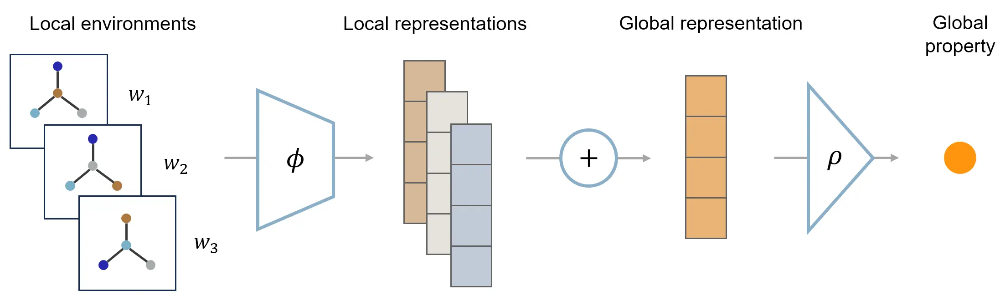

# Local Environment Graph Sets

This repository contains an implementation of the local environment graph sets (LESets) model for high-entropy alloy properties, associated with our paper [Do Graph Neural Networks Work for High Entropy Alloys?](https://arxiv.org/abs/2408.16337)



## Descriptions
`models.py` defines the LESEts model.

`main.py` is for LESets model training and evaluation.

`data_utils.py` is for processing local environment (LE) graph data.

`baseline/` contains the implementation of baseline ML models.

`data/` provides datasets used in the paper. 
- `hea_full.txt` contains HEA compositions and properties from [*npj Comput Mater* 8, 89 (2022)](https://doi.org/10.1038/s41524-022-00779-7). `make_dataset.ipynb` processes this raw data and produces the following files.
- `hea_*.pkl` are processed datasets for each target property. The dataset is organized as a list, where each entry contains a list of LE graphs and the property value.
- `ds_hea_*.pkl` are datasets for baseline models. Lists of LE graphs are replaced by lists of elemental descriptors.

`inspect_att_scores` is for calculating and analyzing the importance scores of elements in HEAs.

`results/` saves model checkpoints and other generated files, and provides model interpretation results.

## Requirements
MolSets requires the following packages:
- PyTorch >= 2.0
- PyG (`torch_geometric`)
- pymatgen (for dataset processing)

The environment can be set up by running
```
conda env create -f environment.yml
```
However, there may be package compatibility issues that need manual corrections. CUDA and GPU-enabled versions of PyTorch and PyG are required to run on GPUs.


## Citation
If you find this code useful, please consider citing the following paper:
```
@misc{zhang-lesets-24,
      title={Do Graph Neural Networks Work for High Entropy Alloys?}, 
      author={Hengrui Zhang and Ruishu Huang and Jie Chen and James M. Rondinelli and Wei Chen},
      year={2024},
      eprint={2408.16337},
      archivePrefix={arXiv},
      primaryClass={cs.LG},
      url={https://arxiv.org/abs/2408.16337}
}
```
